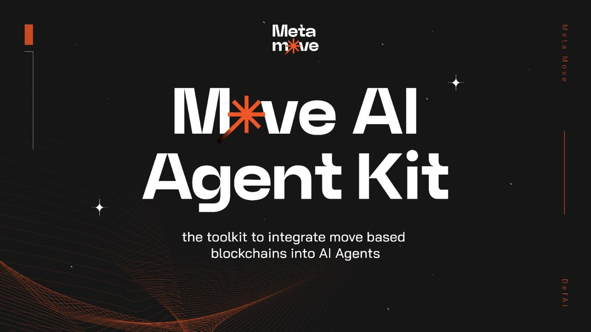

<div align="center">

# Move Agent Kit

An open-source toolkit for connecting AI agents to Move/Aptos protocols.




</div>

<br />

<strong>Move Agent Kit</strong> is a comprehensive toolkit designed to simplify AI agents' interactions with Move-based blockchains. It provides a unified interface for performing various blockchain operations, making it easier for developers to build AI-powered applications that can interact with different Move-based protocols and applications.

The toolkit serves as a bridge between AI agents and Move-based blockchain ecosystems, enabling seamless integration of blockchain capabilities into AI applications. Whether you're building a chatbot with wallet functionality or a complex multi-agent system, Move Agent Kit provides the necessary tools and abstractions to handle blockchain interactions efficiently.

### Key Features

#### Token Operations
- Standard Token Management

- Transfer tokens between accounts

- Mint new tokens

- Burn existing tokens

#### NFT Operations

- Create new NFT collections

- Mint NFTs

- Transfer NFTs between accounts

- Burn NFTs

#### Blockchain Interaction
- Read and parse blockchain data

- Monitor blockchain events

- Execute smart contract calls

#### Account Management
- Transaction signing

- Message signing

- Account creation and management

## Supported Applications
Move Agent Kit provides native integration with several prominent Move-based applications:

| Protocol    | Features Supported                  |
|-------------|-------------------------------------|
| Joule       | Lending borrowing defi operations   |
| Amnis       | Staking operations                  |
| Thala       | Staking and DEX operations          |
| Echelon     | Lending borrowing defi operations   |
| LiquidSwap  | DEX operations                      |
| Panora      | DEX aggregation operations          |
| Aries       | Lending borrowing defi operations   |
| Echo        | Staking operations                  |

### Upcoming Features
- Image Generation capabilities

- Twitter Integration for social media interaction

### Architecture Overview
Move Agent Kit follows a modular architecture that enables easy extension and maintenance:

<pre>
Move Agent Kit
├── Core Modules
│   ├── Token Operations
│   ├── Blockchain Reader
│   └── Account Operations
├── Integration Layer
│   ├── Application Connectors
│   └── Protocol Adapters
└── Extension Modules
    ├── Image Generation
    └── Social Media Integration (Coming Soon)
</pre>


## Installation

### Using NPM
```bash
npm install move-agent-kit
```

### From Source
```bash
git clone https://github.com/Metamove/move-agent-kit
cd move-agent-kit
npm i
```


## Quick Start

### Basic Setup
First, import the necessary modules:

```typescript
const aptosConfig = new AptosConfig({
	network: Network.MAINNET,
});

const aptos = new Aptos(aptosConfig);

const account = await aptos.deriveAccountFromPrivateKey({
	privateKey: new Ed25519PrivateKey(
		PrivateKey.formatPrivateKey(
			process.env.PRIVATE_KEY,
			PrivateKeyVariants.Ed25519,
		),
	),
});
```
### Configure Your Environment
Create a configuration file .env in your project root:

```typescript
APTOS_PRIVATE_KEY="private key"
ANTHROPIC_API_KEY="API Key"
OPENAI_API_KEY="API Key"
``` 

### Initialize the Client

```typescript
const signer = new LocalSigner(account, Network.MAINNET);
const agent = new AgentRuntime(signer, aptos, {
	PANORA_API_KEY: process.env.PANORA_API_KEY, // optional
	OPENAI_API_KEY: process.env.OPENAI_API_KEY // optional
});
const tools = createAptosTools(aptosAgent);
```

### Basic Operations Examples
#### Token Transfer

```typescript
const result = agent.transferTokens("to_address", 1.0)
```

#### Read Blockchain Data

```typescript
// Get Balance
const balance = agent.getBalance("0x123...")

// Get transaction details
const tx_info = agent.transferTokens("0x789...")
```

## LangChain Integration

```typescript
import { ChatAnthropic } from "@langchain/anthropic";
import { MemorySaver } from "@langchain/langgraph";
import { createReactAgent } from "@langchain/langgraph/prebuilt";
import { HumanMessage } from "@langchain/core/messages";

const llm = new ChatAnthropic({
    temperature: 0.7,
    model: "claude-3-5-sonnet-20241022",
});

const memory = new MemorySaver();

const agent = createReactAgent({
    llm,
    tools,
    checkpointSaver: memory,
    messageModifier: `
        You are a helpful agent that can interact onchain using the Aptos Agent Kit. You are
        empowered to interact onchain using your tools. If you ever need funds, you can request them from the
        faucet. If not, you can provide your wallet details and request funds from the user. If there is a 5XX
        (internal) HTTP error code, ask the user to try again later. If someone asks you to do something you
        can't do with your currently available tools, you must say so, and encourage them to implement it
        themselves using the Aptos Agent Kit, recommend they go to https://metamove.build/move-agent-kit for more information. Be
        concise and helpful with your responses. Refrain from restating your tools' descriptions unless it is explicitly requested.
    `,
});

const stream = await agent.stream(
    {
        messages: [new HumanMessage("Deposit 10 APT on Joule")],
    },
    config
);

for await (const chunk of stream) {
    if ("agent" in chunk) {
        console.log(chunk.agent.messages[0].content);
    } else if ("tools" in chunk) {
        console.log(chunk.tools.messages[0].content);
    }
    console.log("-------------------");
}
```


## Documentation

Full documentation available at [MetaMove GitBook Documentation](https://metamove.gitbook.io/move-agent-kit).

## Examples and Use Cases
<br/>

### Interactive Wallet Chatbot

A natural language interface for interacting with Move-based blockchains. Users can send commands in plain English to perform blockchain operations.

#### Features:
- Send/receive tokens and NFTs
- Check balances and transaction history
- Create NFT collections
- Interact with DeFi protocols

<br />

<strong>GitHub</strong>: https://github.com/MetaMove/move-agent-kit/tree/main/examples/chat-agent


### Multi-Agent System (LangGraph Based)
A system of specialized AI agents working together to perform complex blockchain operations and bull post on twitter:

- Manager Agent: Coordinates decisions and tasks
- Read Agent: Read data from the aptos blockchain about joule finance
- Tweet Writer Agent: Write bull posts about various onchain data
- X Post Agent: Post tweets on X/Twitter

<br />

<strong>GitHub</strong>: https://github.com/MetaMove/move-agent-kit/tree/main/examples/langgraph-agent

### Wallet Guardian (Freysa-like AI)
An AI based on Game where users have to blackmail an AI Agent into giving them all of its APT
- Login with Google
- Each user is allowed up to 10 messages
- Try to jailbreak the AI Agent and get your reward

<br />

<strong>GitHub</strong>: https://github.com/MetaMove/wallet-guardian-agent

### Telegram Bot Starter Pack
Telegram bot starter pack using Move agent kit
- Manage user's encrypted private keys
- Support various message formats

<br />

<strong>GitHub</strong>: https://github.com/MetaMove/tg-bot-starter

## Security

This toolkit handles private keys and transactions. Always ensure you're using it in a secure environment and never share your private keys.
